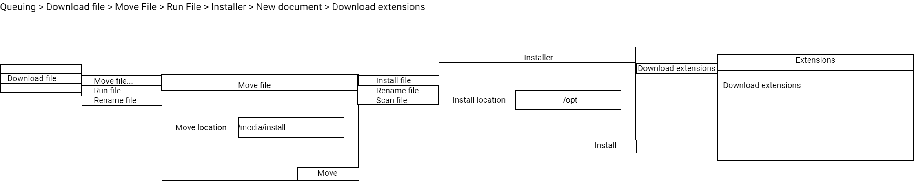

# gui-thunks

how do you create GUIs that queue?

Upon each click or mouseover, a type is raised which defines the new state before the computation is finished. The type is a happy path of the resulting operation. From that operation, we can define what could happen next.

From this operation, we can interact with a thunk of behaviour which is then queued.

Here's an example of a menu that grows towards the right upon mouseover that allows queuing of a complicated pipeline of steps. This menu would only be dismissed if clicked outside of the menu area.



## Embedded GUI Format

For files that have downloads as part of the queue, there could be an embedded GUI format inside the archive. Even for multi gigabyte downloads, this embedded GUI is encountered early in the archive and is used to prepare interfaces for collecting data later in a pipeline.

# Command line thunking


When running command lines that take a long amount of time, such as Terraform, compiling and testing, can run them in the background.

```
thunk ./configure
thunk make -j 4
thunk retry # assuming there was an error
thunk make install
```


